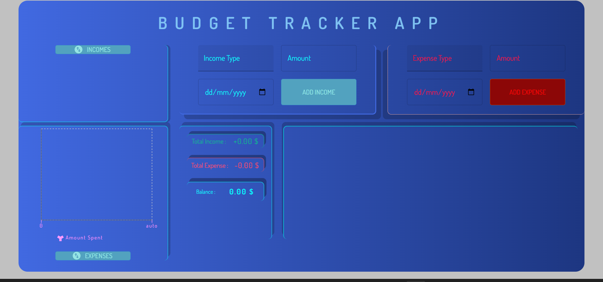
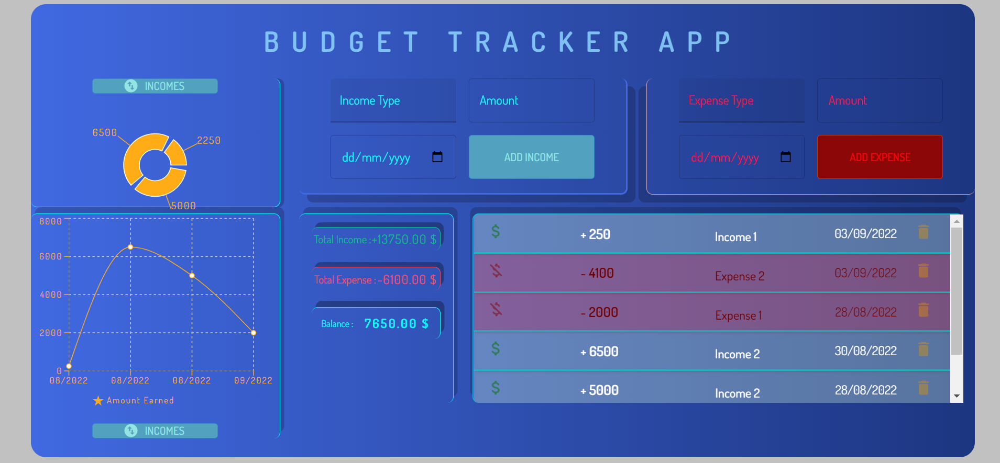
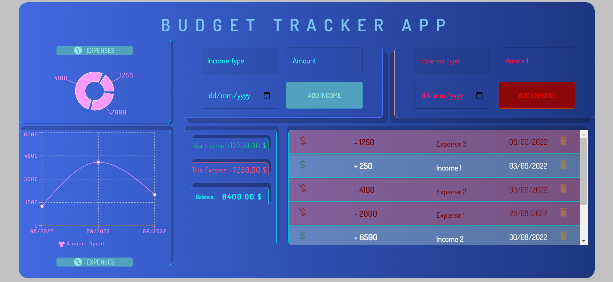
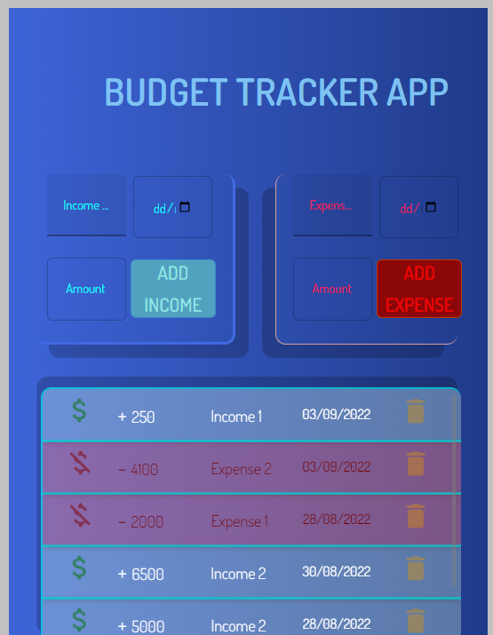
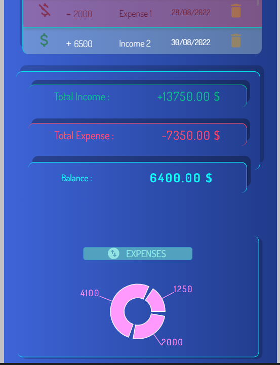
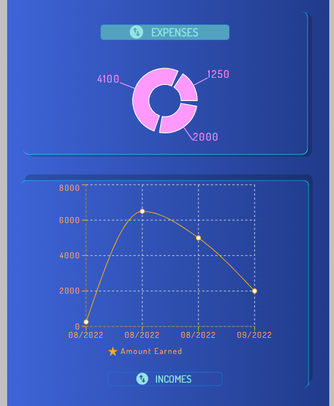

# Budget Tracker App

This is a simple react app that is made with utilizing the material ui library, and it is simply focusing tracing the incomes and expenses with simple charts and list elements.

## Netlify link below:

https://pocket-tracker-react.netlify.app/

## Available Scripts

### Installation:

npm install

### To Run Test Suite:

npm test

### To Start Server:

npm start

### To Visit App:

localhost:3000

## Screenshots

### Screenshot-Nr:1

### Screenshot-Nr:2

### Screenshot-Nr:3

### Screenshot-Nr:4

### Screenshot-Nr:5

### Screenshot-Nr:6

